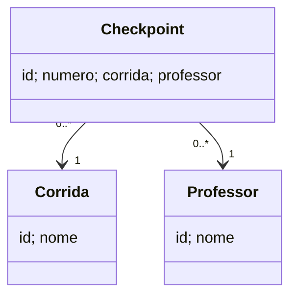

# Sistema de Controle de Checkpoints em Corridas de Trekking

Atividade 1 (Análise, Modelagem, Prototipação e Primeira Implementação) da disciplina Programação Orientada a Serviços — Estudo de Caso 3: Controle de Checkpoints em Corridas de Trekking.

A documentação completa (introdução, requisitos, diagrama de casos de uso, DER e protótipo visual) está em [`docs/relatorio.pdf`](docs/relatorio.pdf).

## Modelo de dados (DER)

- **Corrida** — `id_corrida`, `nome`
- **Professor** — `id_professor`, `nome`
- **Checkpoint** — `id_checkpoint`, `numero`, `id_corrida` (FK), `id_professor` (FK)
- **Equipe** — `id_equipe`, `nome`
- **Passagem** — `id_passagem`, `momento`, `id_corrida` (FK), `id_checkpoint` (FK), `id_equipe` (FK)

O DDL correspondente está em [`schema.sql`](schema.sql).

## Primeira versão da API

Implementada em **Flask + SQLite** (`sqlite3` da biblioteca padrão, sem ORM). O banco (`banco.db`) é criado/atualizado automaticamente na inicialização.

Conforme o escopo desta etapa, **não há** autenticação, validação de entrada ou tratamento elaborado de erros — apenas as operações básicas sobre as tabelas do DER.

### Executando

```bash
python -m venv venv
venv\Scripts\activate        # Windows
# source venv/bin/activate   # Linux/Mac

pip install -r requirements.txt
python app.py
```

A API e a interface sobem em `http://127.0.0.1:5000`. Na v3 a interface não consome a API (usa `localStorage`); o Flask só serve os arquivos estáticos, já que módulos ES não carregam via `file://`.

### Endpoints

| Recurso | Rota | Métodos |
| --- | --- | --- |
| Professores | `/professores` | `GET`, `POST` |
| | `/professores/<id>` | `GET`, `PUT`, `DELETE` |
| Corridas | `/corridas` | `GET` (inclui `total_checkpoints` e `total_passagens`), `POST` |
| | `/corridas/<id>` | `GET` (com checkpoints e passagens), `PUT`, `DELETE` (retorna `409` se a corrida tiver checkpoints ou passagens) |
| Checkpoints | `/corridas/<id_corrida>/checkpoints` | `GET`, `POST` |
| | `/checkpoints/<id>` | `GET`, `PUT`, `DELETE` |
| Equipes | `/equipes` | `GET`, `POST` |
| | `/equipes/<id>` | `GET`, `PUT`, `DELETE` |
| | `/equipes/<id>/historico` | `GET` — histórico de passagens (RF06) |
| Passagens | `/passagens` (aceita `?id_corrida=`) | `GET`, `POST` |
| | `/passagens/<id>` | `GET`, `DELETE` |

`POST /passagens` recebe `id_corrida`, `id_checkpoint` e `id_equipe`; o campo `momento` é preenchido automaticamente pelo servidor (RF04).

### Exemplo de uso

```bash
curl -X POST http://127.0.0.1:5000/professores -H "Content-Type: application/json" -d "{\"nome\":\"Prof. Ana\"}"
curl -X POST http://127.0.0.1:5000/corridas -H "Content-Type: application/json" -d "{\"nome\":\"Trilha da Serra\"}"
curl -X POST http://127.0.0.1:5000/corridas/1/checkpoints -H "Content-Type: application/json" -d "{\"numero\":1,\"id_professor\":1}"
curl -X POST http://127.0.0.1:5000/equipes -H "Content-Type: application/json" -d "{\"nome\":\"Equipe Aventura\"}"
curl -X POST http://127.0.0.1:5000/passagens -H "Content-Type: application/json" -d "{\"id_corrida\":1,\"id_checkpoint\":1,\"id_equipe\":1}"
curl http://127.0.0.1:5000/corridas/1
curl http://127.0.0.1:5000/equipes/1/historico
```

## Interface web

CRUD de **Corrida**, **Professor** e **Checkpoint** em HTML, CSS e JavaScript (módulos ES), com dados no `localStorage`. Para executar: `python app.py` e abrir `http://127.0.0.1:5000/`.

```
frontend/
├── index.html / corridas.html / professores.html / checkpoints.html
├── css/estilo.css
└── js/
    ├── corridas.js, professores.js, checkpoints.js   pontos de entrada das páginas
    ├── classes/     Corrida.js, Professor.js, Checkpoint.js
    ├── dados/       corridas.js, professores.js, checkpoints.js   (localStorage)
    └── interface/   corridas.js, professores.js, checkpoints.js   (listas, formulários, eventos)
```



### Persistência

Chaves: `corridas`, `professores` e `checkpoints`. Em memória o `Checkpoint` referencia objetos `Corrida` e `Professor`; no `localStorage` guarda só os ids:

```json
[{"id":1,"numero":1,"corridaId":1,"professorId":2}]
```

Na carga, corridas e professores são lidos primeiro; depois os checkpoints, que recuperam suas referências pelos ids. Os ids são preservados e `proximoId` é ajustado com `Math.max`.

### Regras de integridade

- Corrida ou professor com checkpoints não pode ser excluído (é exibida uma mensagem).
- O número de um checkpoint não pode se repetir dentro da mesma corrida.

### Como testar

1. Cadastre algumas corridas e professores.
2. Cadastre um checkpoint selecionando a corrida e o professor.
3. Recarregue a página e verifique que os dados e as relações continuam exibidos.
4. Altere e exclua registros.
5. Tente excluir uma corrida ou um professor que tenha checkpoints e veja a mensagem de bloqueio.

### Onde cada capítulo foi aplicado

| Capítulo | Conceito | Onde está |
| --- | --- | --- |
| Cap. 1 — JavaScript na página web | Criação de elementos com `createElement`/`textContent` e inserção no DOM | `render()` das classes |
| Cap. 2 — Objetos e classes | Classes com atributos privados, getters/setters e `render()`; exemplo de herança (`CorridaEmAndamento`) na branch `frontend-v2` | `classes/` |
| Cap. 3 — Eventos e interação | Eventos, formulários em `<dialog>`, botões com `data-acao`, `dataset` | `interface/` + páginas `.html` |
| Cap. 4 — Módulos | `import`/`export`, separação classes/dados/interface e pontos de entrada por página | toda a pasta `js/` |
| Cap. 5 — Recursos relacionados e localStorage | Recursos relacionados, referências entre objetos, `localStorage`, reconstrução de objetos e relações, integridade | `classes/Checkpoint.js`, `dados/`, `interface/checkpoints.js` |
